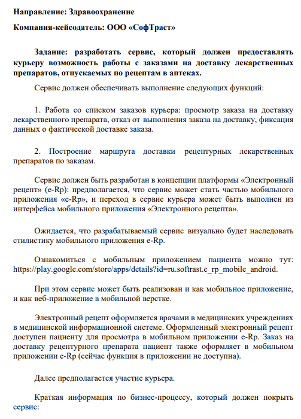
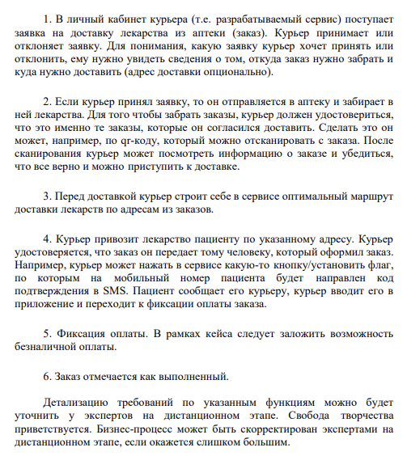

# delivery-of-medicines-API

Проект 'delivery-of-medicines-API
' разработан в рамках чимпионата кейсов УчиTech
## Установка

### Cклонируйте репозиторий GitHub
- `git clone git@github.com:Ваш_аккаунт/<Имя проекта>.git`

### ТЗ
```

```
```

```
### Для запуска перейдите в директорию с файлом manage.py
```
python -m venv venv
Активируйте виртуальное окружение
pip install -r requirements.txt
python manage.py migrate
Добавьте в таблицу город 1 город
python manage.py createsuperuser
python manage.py runserver
```

## Использование
- Документация доступна по адресу:
```
  /swagger/
```

## Участие в разработке
    Denchur
